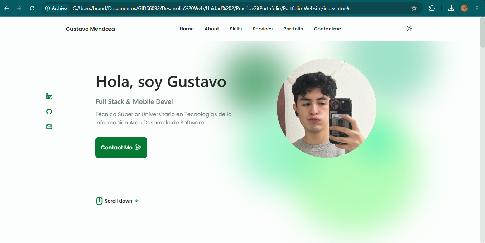
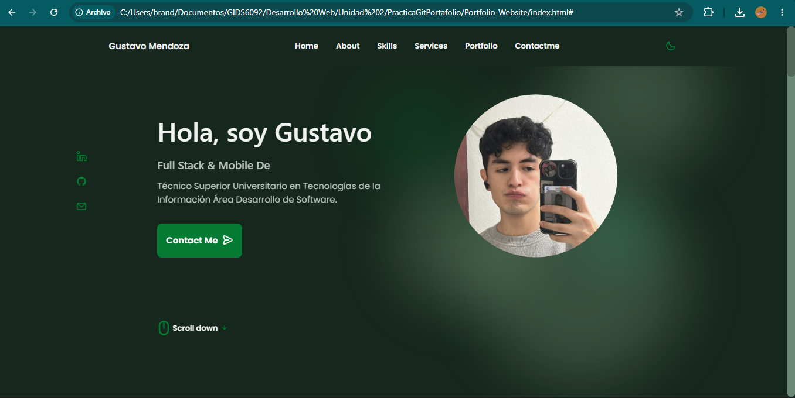
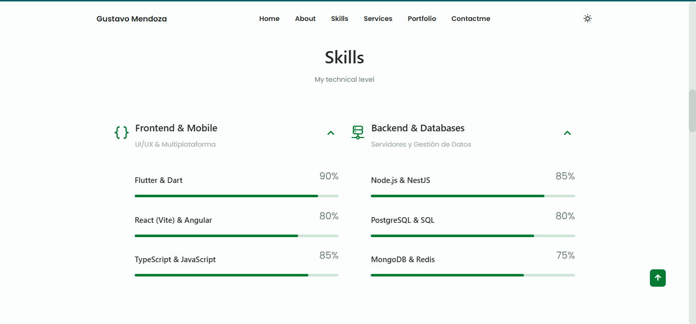
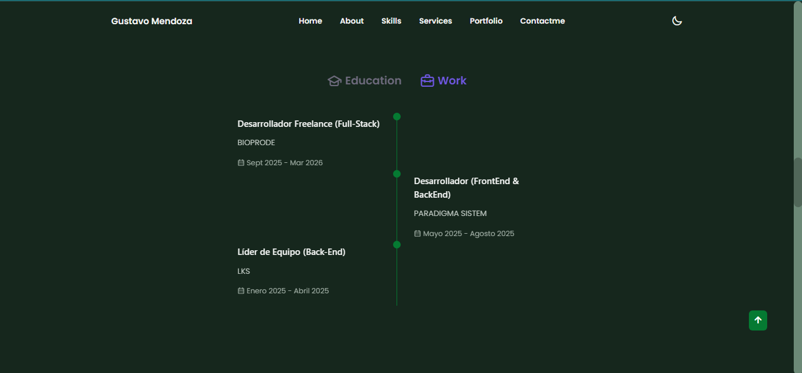
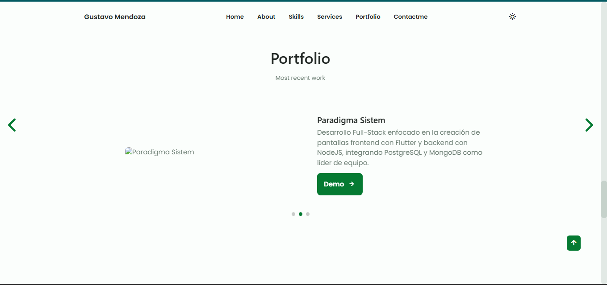

# Reporte Técnico: Personalización y Optimización de Portafolio Profesional Web

## 👨‍💻 Información del Desarrollador
* **Nombre Completo:** Brandon Gustavo Mendoza Amaro
* **Programa Académico:** Técnico Superior Universitario en Tecnologías de la Información, Área Desarrollo de Software
* **Institución:** Universidad Tecnológica del Norte de Guanajuato (UTNG)
* **Fecha:** Mayo de 2026

---

## 🎯 Objetivo de la Práctica
Desplegar, personalizar y optimizar una plantilla web profesional de portafolio interactivo utilizando tecnologías frontend estándar y arquitecturas de estilos modernas. El proceso se gestionó mediante control de versiones con **Git** y se alojó en **GitHub**, logrando una identidad visual corporativa única basada en una paleta de colores personalizada y efectos visuales avanzados de profundidad.

---

## 🛠️ Tecnologías e Infraestructura Utilizadas

El núcleo tecnológico del proyecto se compone de las siguientes herramientas:

* **HTML5:** Estructuración semántica del perfil, cualificaciones, servicios y proyectos.
* **CSS3:** Maquetación responsiva basada en CSS Grid, variables globales (Custom Properties) en formato HSL y diseño adaptativo.
* **JavaScript (ES6+):** Lógica interactiva para la conmutación de temas (Light/Dark mode) y sliders dinámicos.
* **Git:** Control de versiones local para el seguimiento de cambios y manejo de ramas.
* **GitHub:** Repositorio remoto para el respaldo de código, colaboración y despliegue continuo.

### 📦 Librerías y Recursos Externos Integrados
* **Unicons (Iconscout):** Paquete de iconos vectoriales para la interfaz.
* **SwiperJS:** Motor de transiciones táctiles para la galería de proyectos del portafolio.
* **AOS (Animate On Scroll):** Biblioteca para la ejecución de animaciones fluidas al interactuar con el scroll.

---

## 🔄 Cambios y Mejoras de Diseño Implementados

Se realizaron modificaciones estructurales y estéticas de alto impacto para transformar la plantilla base en un producto digital personalizado:

1. **Refactorización de Datos Personales:** Reemplazo de la información genérica por el perfil real del desarrollador, incluyendo la trayectoria académica como TSU y la experiencia en proyectos reales como *BioProde*, *Paradigma Sistem* y *LKS*.
2. **Rediseño de Identidad Cromática (Brand Refresh):** Sustitución del tono morado original por un verde institucional profundo (`#057932`). La conversión a formato HSL (`hsl(143, 92%, 25%)`) permitió recalcular automáticamente las variantes para efectos *hover*, bordes e inputs de manera armónica.
3. **Efectos Visuales Avanzados (UI/UX Fluid Background):** Diseño e inserción de 6 círculos decorativos flotantes con desenfoque de fondo (`filter: blur(40px)`) y animaciones orgánicas infinitas (`@keyframes float`). Estos se optimizaron con baja opacidad en el modo oscuro para mantener la legibilidad.
4. **Adaptación Responsiva:** Optimización de las rejillas (`grids`) del Home y de la sección de habilidades para una correcta distribución espacial en dispositivos móviles y de escritorio.

---

## 💻 Flujo de Trabajo y Comandos Git Utilizados

Para garantizar la integridad del código y mantener un historial de desarrollo limpio, se utilizó el siguiente flujo de trabajo en la terminal:

| Comando Git | Propósito y Aplicación en el Proyecto |
| :--- | :--- |
| `git clone <url>` | Clonación del repositorio base original a la estación de trabajo local para iniciar el desarrollo. |
| `git branch <nombre>` | Creación de una rama de desarrollo independiente para experimentar con los círculos decorativos y el cambio de color sin afectar la rama principal. |
| `git status` | Monitoreo constante del estado de los archivos modificados (HTML, CSS) antes de agregarlos al área de preparación. |
| `git add .` | Registro en el *Staging Area* de todas las actualizaciones cromáticas, estructurales y nuevos recursos visuales. |
| `git commit -m "msg"` | Registro local de los cambios con mensajes descriptivos estructurados (e.g., `feat: cambio de paleta a verde corporativo y adición de fondo dinámico`). |
| `git pull origin main` | Sincronización y descarga de posibles cambios en el repositorio remoto antes de realizar una integración. |
| `git push origin <rama>` | Carga segura del historial de confirmaciones locales hacia el repositorio hospedado en GitHub. |

---

## 📸 Evidencias de Implementación

### 1. Vista Principal (Sección Home - Modo Claro)
Muestra la nueva paleta de colores verde (`#057932`) aplicada a los botones, iconos sociales y el efecto flotante de los 6 círculos difuminados de fondo en el tema claro.

### 2. Sección de Habilidades y Modo Oscuro Activo
Evidencia de la transición de los círculos de fondo a una opacidad tenue (`opacity: 0.2`) en el modo nocturno para proteger la vista del usuario, manteniendo el contraste de los textos.

### 3. Cualificaciones y Línea de Tiempo Académica/Laboral
Detalle de la sección de experiencia laboral configurada con los proyectos de desarrollo freelance y roles de liderazgo.

### 4. Sección de Portafolio Responsivo (Carrusel Activo)
Demostración del funcionamiento de *SwiperJS* integrando los detalles y las descripciones de los proyectos personalizados.

